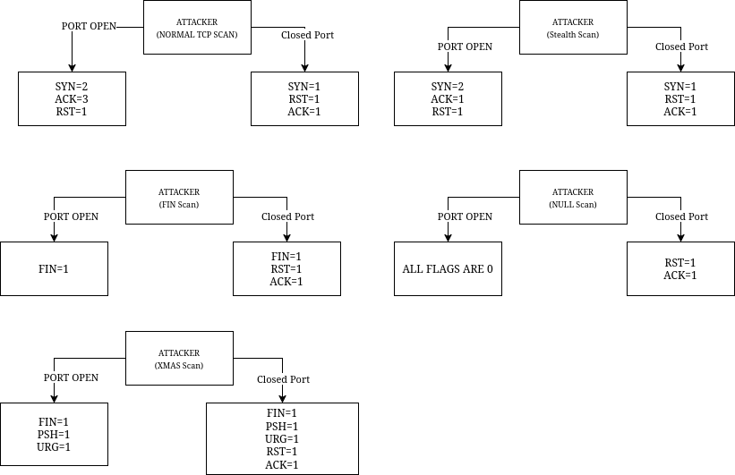

# nmap-harvester

A supervised machine learning model designed for detecting `NMAP` port scanning, developed as part of a university project.

---

## Introduction

This project aims to build a supervised machine learning model to detect real-time `NMAP` port scanning activities.

In many cyber-attacks, the initial step often involves port scanning using tools like `NMAP`. Detecting such scans can be challenging because network packets carry extensive information, and a single packet isn't enough to confirm an `NMAP` scan attempt.

To address this, this project proposes a machine learning-based approach for identifying TCP port scans initiated by `NMAP`.

How the `interceptor.py` collects all TCP flags can be summered in the following scheme.



All this attack data are collected by the `interceptor.py` which listens for coming connection on a specific ip address.

In the project the following files have the described functions:

- `interceptor.py` -> monitor for collecting data
- `algo_chooser.py` -> script for choosing the best machine learning algorithm
- `injector.py` -> injects nmap scans or run normal http requests
- `noiser.py` -> helper script for sending normal http requests
- `detector.py` -> runs a real-time demo of the model using previously mentioned scripts internally
- `model` directory -> contains exported model
- `merger.py` -> merges 2 datasets in one single dataset
- `datasets/delayed/merged.csv` -> contains just another dataset for calculating accuracy and other stats 
- `datasets/train/merged.csv` -> contains the datasets used for training the model
- `datasets/runtime` -> contains generated runtime datasets when running `detector.py`

---

## Train Dataset Creation (datasets/train/merged.csv)

Understanding TCP connections is important for building the dataset. When a TCP packet is sent over the network, it carries specific flags that facilitate the `3-Way Handshake`. `NMAP` can manipulate these flags to evade detection while performing rapid port scans. We cannot create a dataset where each row of the dataset represents a packet since for detecting `NMAP`, multiple packets are needed, so the idea:

### Key Dataset Characteristics 

- **Session-Based Rows:** Instead of logging each packet individually, each row in the dataset represents a **session** (requests + responses).
- **Flag Summation:** Flags (`SYN`, `ACK`, `FIN`, etc.) are aggregated across the session. For example:  
  - If a `SYN` packet is sent by `NMAP` and another `SYN` is part of the response, the `SYN` column will record a value of `2`.

### Example Dataset Row (normal tcp scan on a closed port 3306)

```csv
start_request_time,end_request_time,start_response_time,end_response_time,duration,src_ip,dst_ip,src_port,dst_port,SYN,ACK,FIN,RST,URG,PSH,label
2025-01-08 13:52:55.274814,2025-01-08 13:52:55.274814,2025-01-08 13:52:55.274874,2025-01-08 13:52:55.274874,6e-05,"['172.31.0.1', '172.31.0.2']","['172.31.0.1', '172.31.0.2']","['44031', '3306']","['44031', '3306']",1,1,0,1,0,0,1
```

- Sessions are grouped using `src_ip`, `dst_ip`, `src_port`, and `dst_port` tuple as keys. However, these grouping keys are excluded from the model's training phase.

- The `duration` feature provides valuable information for distinguishing between legitimate traffic and `NMAP` scans, as legitimate HTTP requests may exhibit similar flag behaviour but differ in timing.

- The session window in `interceptor.py` is set to **0.5 seconds** by default, as this is typically enough to capture an `NMAP` scan attempt.

More technical explanations are present via comments in `interceptor.py`. The script takes a while for writing succesfully all the data when a lot of requests are performed.

### Common `NMAP` Scans

The following commands were run from the container called `traffic_generator` having the `sudo python3 interceptor.py` running locally.

```bash
nmap -sT 172.31.0.1 -p 0-5000 # TCP Scan
nmap -sS 172.31.0.1 -p 0-5000 # Stealth Scan
nmap -sF 172.31.0.1 -p 0-5000 # FIN Scan
nmap -sN 172.31.0.1 -p 0-5000 # NULL Scan
nmap -sX 172.31.0.1 -p 0-5000 # XMAS Scan
```

The result is the creation of `bad.csv`

Then the script `noiser.py` was used for generating `good.csv`

The final dataset consists of a merge (`merged.csv`) used for training the model:

- `bad.csv`: Sessions labelled as `1` (`NMAP` traffic).
- `good.csv`: Sessions labelled as `0` (legitimate traffic).

---

## Machine Learning Model

The `XGBClassifier` was selected as the final model due to its reliable performance in key areas:

1. High accuracy score (`~0.95`)
2. Fast prediction speed (`~3ms` on average for 15,000 rows)
3. High MCC score (`~0.91`)

### Why accuracy metric is important?

The dataset generated for training purposes contains a balanced example of normal/anomaly behaviours, half normal and half anomalies, which get shuffled during the dataset splitting phase. Thus, accuracy is an important statistic that can be considered in this case.

### Why MCC is not that important?

MCC should normally be preferred when unbalanced datasets are present. This is not our case, but it is taken into account even if it has a minor weight in the final machine-learning model choice.

### Why the prediction speed is so important?

The prediction speed played a significant role in choosing this model, as it allows efficient analysis of large volumes of network traffic in real-time. The `RandomForestClassifier` is pretty similar in accuracy (maybe even better sometimes), but it has a slower prediction time in average of `~15ms` compared to `~3ms` of `XGBClassifier`

### Model Performance

```
Dataset loaded with 15192 records.
Dataset preprocessed successfully.

+------------+-----+-----+-----+-----+-----+-----+-------+
|  duration  | SYN | ACK | FIN | RST | URG | PSH | label |
+------------+-----+-----+-----+-----+-----+-----+-------+
|  0.000030  |  1  |  1  |  0  |  1  |  0  |  0  |   1   |
|  0.000013  |  1  |  1  |  0  |  1  |  0  |  0  |   1   |
|  0.000012  |  1  |  1  |  0  |  1  |  0  |  0  |   1   |
|  0.000010  |  1  |  1  |  0  |  1  |  0  |  0  |   1   |
|  0.000011  |  1  |  1  |  0  |  1  |  0  |  0  |   1   |
+------------+-----+-----+-----+-----+-----+-----+-------+

Dataset split into training and testing sets.

RandomForestClassifier (n_estimators=199): Accuracy: 0.9513, Train time: 395ms, Prediction time: 16ms, MCC: 0.902033, TP: 661, TN: 785, FN: 33, FP: 41
RandomForestClassifier (n_estimators=200): Accuracy: 0.9513, Train time: 398ms, Prediction time: 16ms, MCC: 0.902033, TP: 661, TN: 785, FN: 33, FP: 41
RandomForestClassifier (n_estimators=201): Accuracy: 0.9513, Train time: 405ms, Prediction time: 17ms, MCC: 0.902033, TP: 661, TN: 785, FN: 33, FP: 41
RandomForestClassifier (n_estimators=202): Accuracy: 0.9513, Train time: 397ms, Prediction time: 16ms, MCC: 0.902033, TP: 661, TN: 785, FN: 33, FP: 41
RandomForestClassifier (n_estimators=203): Accuracy: 0.9513, Train time: 408ms, Prediction time: 16ms, MCC: 0.902033, TP: 661, TN: 785, FN: 33, FP: 41
RandomForestClassifier (n_estimators=204): Accuracy: 0.9513, Train time: 416ms, Prediction time: 17ms, MCC: 0.902033, TP: 661, TN: 785, FN: 33, FP: 41
RandomForestClassifier (n_estimators=205): Accuracy: 0.9513, Train time: 409ms, Prediction time: 16ms, MCC: 0.902033, TP: 661, TN: 785, FN: 33, FP: 41
RandomForestClassifier (n_estimators=206): Accuracy: 0.9513, Train time: 411ms, Prediction time: 17ms, MCC: 0.902033, TP: 661, TN: 785, FN: 33, FP: 41
RandomForestClassifier (n_estimators=207): Accuracy: 0.9513, Train time: 409ms, Prediction time: 16ms, MCC: 0.902033, TP: 661, TN: 785, FN: 33, FP: 41
RandomForestClassifier (n_estimators=208): Accuracy: 0.9513, Train time: 403ms, Prediction time: 17ms, MCC: 0.902033, TP: 661, TN: 785, FN: 33, FP: 41
RandomForestClassifier (n_estimators=209): Accuracy: 0.9513, Train time: 405ms, Prediction time: 17ms, MCC: 0.902033, TP: 661, TN: 785, FN: 33, FP: 41
RandomForestClassifier (n_estimators=210): Accuracy: 0.9513, Train time: 432ms, Prediction time: 16ms, MCC: 0.902033, TP: 661, TN: 785, FN: 33, FP: 41

....

XGBClassifier (n_estimators=201): Accuracy: 0.9507, Train time: 65ms, Prediction time: 3ms, MCC: 0.900685, TP: 660, TN: 785, FN: 34, FP: 41
XGBClassifier (n_estimators=202): Accuracy: 0.9507, Train time: 64ms, Prediction time: 3ms, MCC: 0.900685, TP: 660, TN: 785, FN: 34, FP: 41
XGBClassifier (n_estimators=203): Accuracy: 0.9507, Train time: 51ms, Prediction time: 3ms, MCC: 0.900685, TP: 660, TN: 785, FN: 34, FP: 41
XGBClassifier (n_estimators=204): Accuracy: 0.9507, Train time: 45ms, Prediction time: 3ms, MCC: 0.900685, TP: 660, TN: 785, FN: 34, FP: 41
XGBClassifier (n_estimators=205): Accuracy: 0.9507, Train time: 42ms, Prediction time: 3ms, MCC: 0.900685, TP: 660, TN: 785, FN: 34, FP: 41
XGBClassifier (n_estimators=206): Accuracy: 0.9507, Train time: 55ms, Prediction time: 6ms, MCC: 0.900685, TP: 660, TN: 785, FN: 34, FP: 41
XGBClassifier (n_estimators=207): Accuracy: 0.9507, Train time: 64ms, Prediction time: 3ms, MCC: 0.900685, TP: 660, TN: 785, FN: 34, FP: 41
XGBClassifier (n_estimators=208): Accuracy: 0.9507, Train time: 77ms, Prediction time: 3ms, MCC: 0.900685, TP: 660, TN: 785, FN: 34, FP: 41
XGBClassifier (n_estimators=209): Accuracy: 0.9507, Train time: 42ms, Prediction time: 3ms, MCC: 0.900685, TP: 660, TN: 785, FN: 34, FP: 41
XGBClassifier (n_estimators=210): Accuracy: 0.9507, Train time: 65ms, Prediction time: 3ms, MCC: 0.919739, TP: 660, TN: 785, FN: 34, FP: 41

Best Classifier based on Accuracy
Classifier: RandomForestClassifier
n_estimators: 210
Accuracy Score: 0.9513

Best Classifier based on MCC
Classifier: XGBClassifier
n_estimators: 210
MCC Score: 0.919739
```

---

## How Training Dataset was created (detailed)

The training dataset, `datasets/train/merged.csv`, is generated using the following steps:

1. Create an isolated Docker environment for sending clean packets:
   ```bash
   docker compose up --build
   ```
2. Access the container:
   ```bash
   docker attach traffic_generator
   ```
3. Run the interceptor on the host from another terminal:
   ```bash
   sudo python3 interceptor.py
   ```
   - Before to run, adjust:
     - `interface`: Docker network interface name
     - `scanner_ip`: IP assigned to `traffic_generator`
     - `output_file`: Output CSV file path
     - `label`: `0` for legitimate traffic, `1` for `NMAP` scans
4. Run `NMAP` scans from the container:
   ```bash
      nmap -sT 172.31.0.1 -p 0-5000 
      nmap -sS 172.31.0.1 -p 0-5000
      nmap -sF 172.31.0.1 -p 0-5000
      nmap -sN 172.31.0.1 -p 0-5000
      nmap -sX 172.31.0.1 -p 0-5000
   ```
5. Run noise traffic for legitimate requests, from the container:
   ```bash
   python3 noiser.py
   ```
6. Merge datasets:
   ```bash
   cd datasets
   python3 merger.py
   ```
7. Train the model:
   ```bash
   python3 algo_chooser.py
   ```

### Delayed Dataset

A delayed dataset can be created by introducing delays between requests:

```bash
nmap -p 1-10000 --scan-delay 1s 172.31.0.1
```

You can also adjust the delay in legitimate requests by modifying `SLEEP_SECOND` in `noiser.py`.

Results:

```
Dataset loaded with 11351 records.                                                                                                                                                                                  
Dataset preprocessed successfully.                                                                                                                                                                                  
+------------+-----+-----+-----+-----+-----+-----+-------+
|  duration  | SYN | ACK | FIN | RST | URG | PSH | label |
+------------+-----+-----+-----+-----+-----+-----+-------+
|  0.000060  |  1  |  1  |  0  |  1  |  0  |  0  |   1   |
|  0.000068  |  1  |  1  |  0  |  1  |  0  |  0  |   1   |
|  0.000062  |  1  |  1  |  0  |  1  |  0  |  0  |   1   |
|  0.000057  |  1  |  1  |  0  |  1  |  0  |  0  |   1   |
|  0.000074  |  1  |  1  |  0  |  1  |  0  |  0  |   1   |
+------------+-----+-----+-----+-----+-----+-----+-------+

Dataset split into training and testing sets.

....
XGBClassifier (n_estimators=210): Accuracy: 1.0000, Train time: 28ms, Prediction time: 3ms, MCC: 1.000000, TP: 743, TN: 393, FN: 0, FP: 0

Best Classifier based on MCC
Classifier: XGBClassifier
n_estimators: 210
MCC Score: 1.000000
```

---

## Running the Detector

To run the detector:

```bash
sudo python3 detector.py
```

- The detector uses `interceptor.py` to monitor session packets.
- `injector.py` simulates normal HTTP traffic with occasional `NMAP` scans (10% probability).
- If at least **30%** of session packets are flagged as anomalies, the system will detect an ongoing `NMAP` attack.

---

## Requirements

Install dependencies with:

```bash
python3 -m venv venv && source venv/bin/activate && pip install -r requirements.txt
```

---

## Demonstration Video

https://github.com/user-attachments/assets/f10773c6-742e-4394-913e-42beb0cc3683

## References

- [Medium Article on `NMAP` Detection](https://medium.com/@thismanera/nmap-detection-with-wireshark-e780c73a0823)
- [Unix Stack Exchange - Detecting `NMAP` Scans](https://unix.stackexchange.com/questions/166734/whats-the-most-effective-way-to-detect-nmap-scans)

---

## External Dependencies

- `pyshark`
- `python-nmap`
